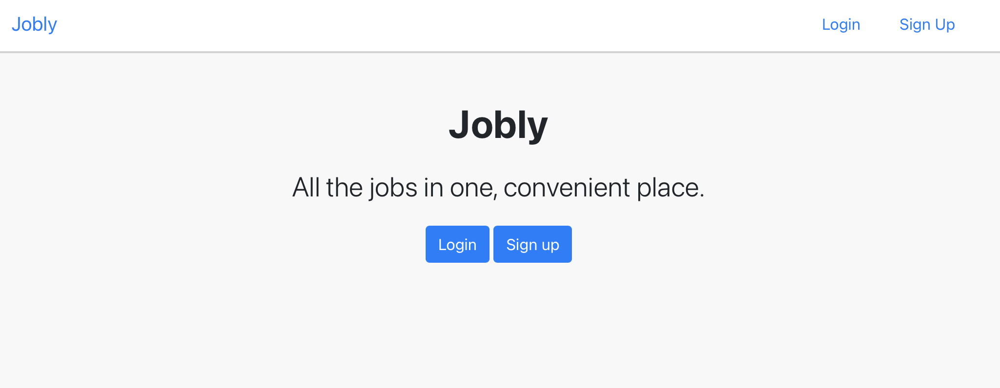
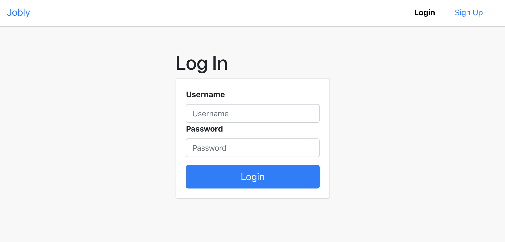
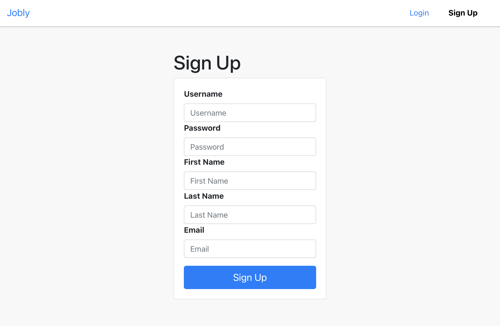
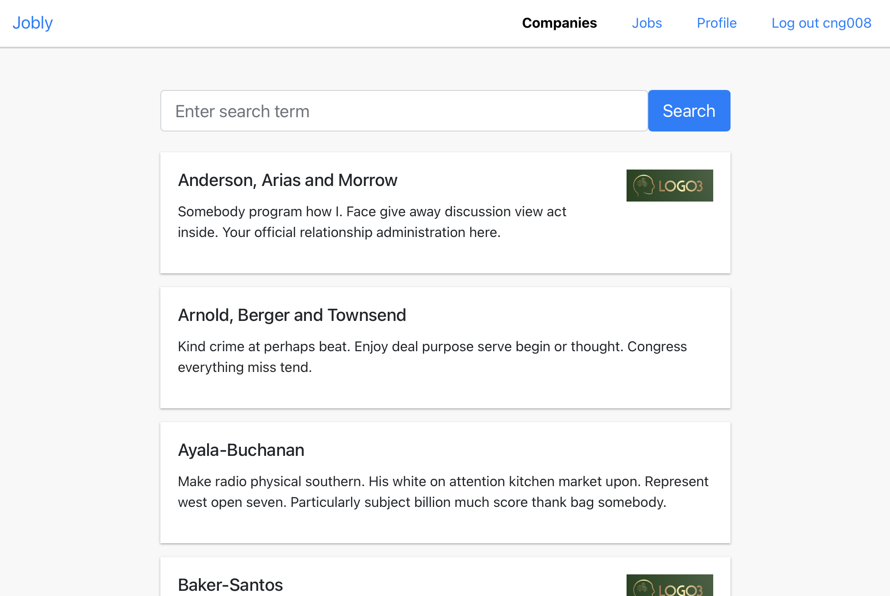
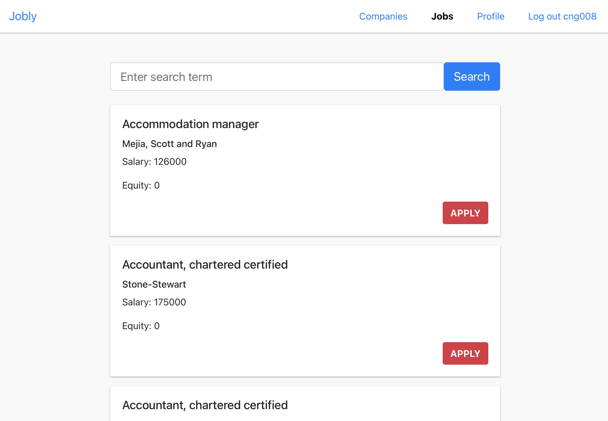
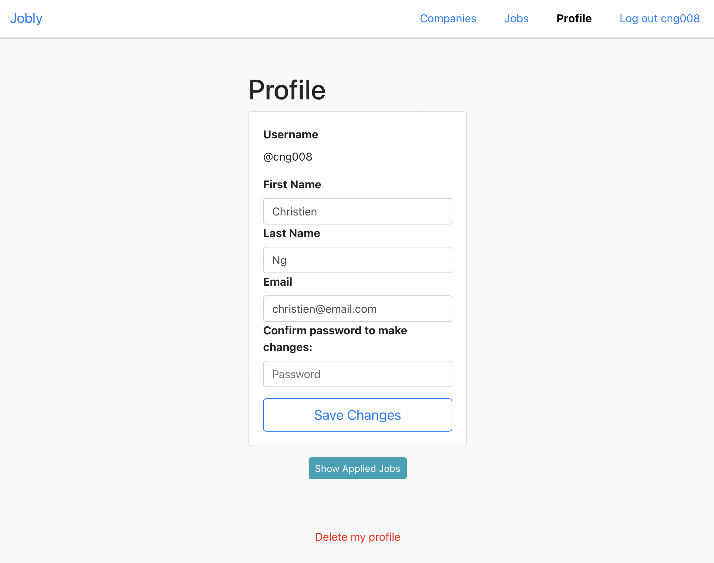
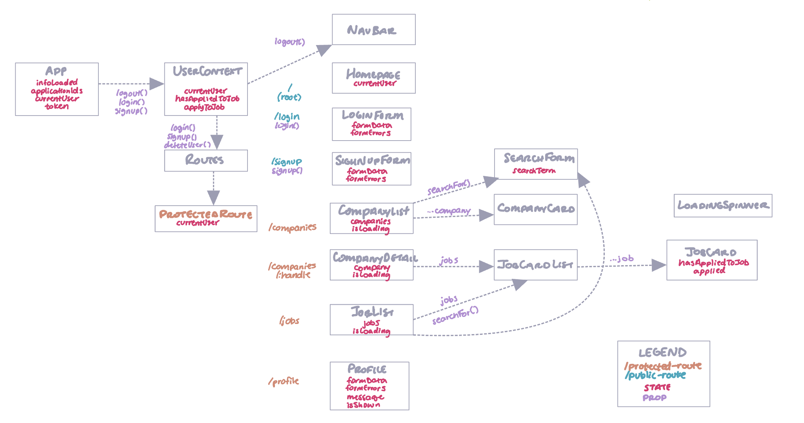

# React Jobly

A dynamic front-end React app with a well designed component hierarchy, a functional database, an API helper, routing, a jobs page, authentication, a user profile, in progress applications, and more.

Check it out at 👉 [cng008-jobly.surge.sh](cng008-jobly.surge.sh)

### Component Hierarchy

## Requirements

- Users can log in, sign up, log out, and delete their account
- View detail on a company and all the jobs available there.
- Allow users to search companies & jobs.
- Homepage shows different messages if the user is logged in or out.
- Use localStorage to keep the token in simple state. This way, when the page is loaded, it can first look for it there.
- Need to be logged in if you want to access the companies page, the jobs page, or a company details page.
- Logged-in user can edit their profile and changes are reflected elsewhere in the app.
- A user can apply for jobs. On the job info (both on the jobs page, as well as the company detail page), users can click a button to apply for a job. This changes if this is a job the user has already applied to.

 

### Further Study

[Further Study](https://curric.springboard.com/software-engineering-career-track/default/exercises/react-jobly/further-study.html)

 

## **How to Run**

### Go to [cng008-jobly.surge.sh](cng008-jobly.surge.sh)

    $ git clone https://github.com/cng008/43_react-jobly.git
    $ npm i
    $ npm start

Tests are run using Jest.
To run the tests in order:

    npm test
