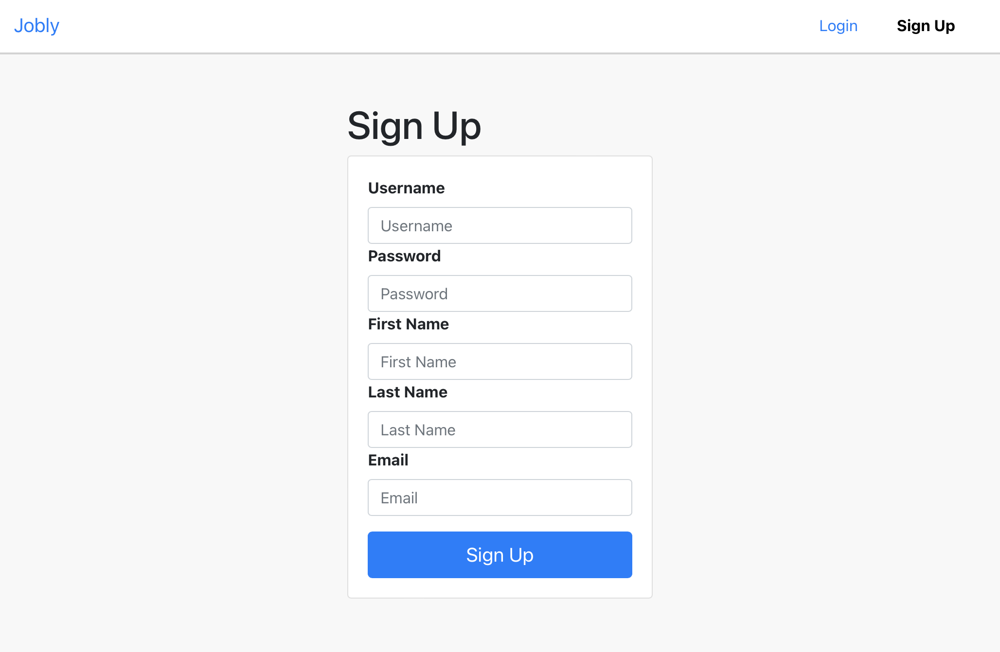
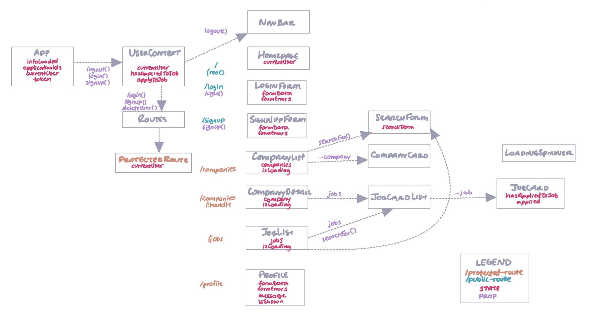

# React Jobly

A dynamic full stack web application which will be used to explore and "apply" for jobs online (no, these won't be REAL jobs). Functionality is similar to LinkedIn, but on a smaller scale, with a well-designed component hierarchy, a functional database, queryable API, routing, a jobs page, authentication and authorization, a user profile, in-progress applications, and more!

Check it out at 👉 [http://cng008-jobly.surge.sh](http://cng008-jobly.surge.sh)

### Component Hierarchy

## Requirements

- Users can log in, sign up, log out, and delete their account
- View detail on a company and all the jobs available there.
- Allow users to search companies & jobs.
- Homepage shows different messages if the user is logged in or out.
- Use localStorage to keep the token in simple state. This way, when the page is loaded, it can first look for it there.
- Need to be logged in if you want to access the companies page, the jobs page, or a company details page.
- Logged-in user can edit their profile and changes are reflected elsewhere in the app.
- A user can apply for jobs. On the job info (both on the jobs page, as well as the company detail page), users can click a button to apply for a job. This changes if this is a job the user has already applied to.

 

### Further Study

[Further Study](https://curric.springboard.com/software-engineering-career-track/default/exercises/react-jobly/further-study.html)

 

## **Tech Stack**

This project was made using the following technologies:

- [HTML](https://developer.mozilla.org/en-US/docs/Web/HTML)
- [CSS](https://developer.mozilla.org/en-US/docs/Web/CSS)
- [Bootstrap 5](https://getbootstrap.com/docs/5.1/getting-started/introduction/)
- [Node.js](https://nodejs.org/en/)
- [Node.js-Bcrypt](https://www.npmjs.com/package/bcrypt)
- [PostgreSQL](https://www.postgresql.org)
- [Express](https://expressjs.com/en/4x/api.html)
- [JWT](https://www.npmjs.com/package/jsonwebtoken)
- [Axios](https://axios-http.com/docs/intro)
- [React](https://reactjs.org)
- [ReactDOM](https://reactjs.org/docs/react-dom.html)
- [Reactstrap](https://reactstrap.github.io)
- [Jest](https://jestjs.io)
- [Unittests](https://docs.python.org/3/library/unittest.html)
- [Supertest](https://github.com/visionmedia/supertest)
- [Morgan](https://www.npmjs.com/package/morgan)
- [Heroku](https://www.heroku.com)
- [Surge.sh](https://surge.sh)
- [VSCode](https://code.visualstudio.com/docs)

## **How to Run**

### Go to [http://cng008-jobly.surge.sh](http://cng008-jobly.surge.sh)

    $ git clone https://github.com/cng008/43_react-jobly.git
    $ npm i
    $ npm start

Tests are run using Jest.
To run the tests in order:

    npm test
